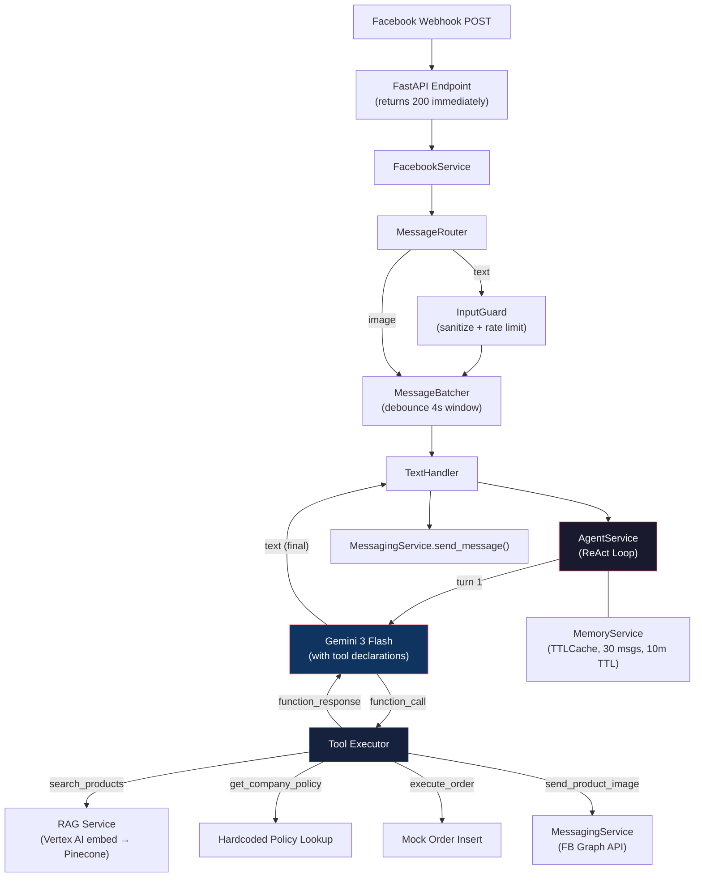
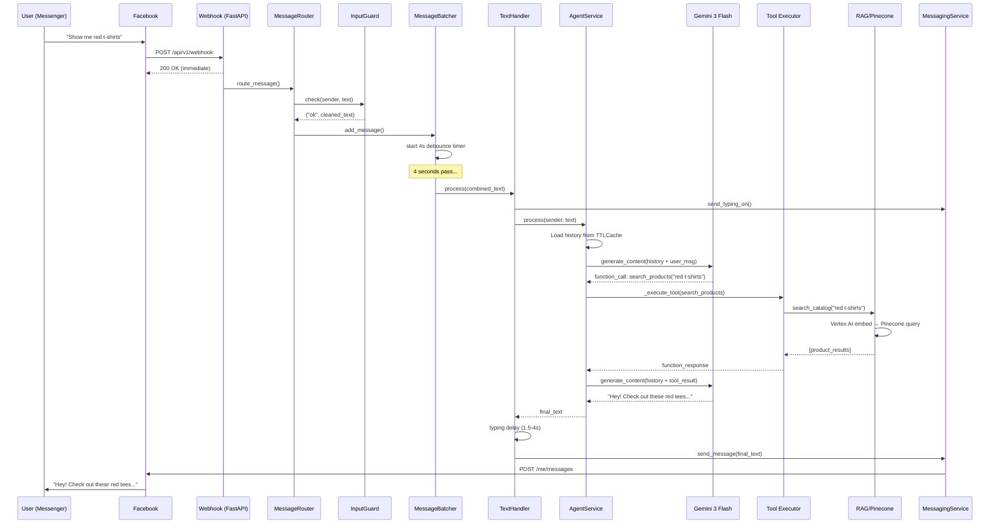

# DaamKoto — Agentic Architecture Analysis

## Current Architecture at a Glance



---

## What's Working Well ✅

| Aspect | Assessment |
|--------|------------|
| **ReAct loop with manual tool dispatch** | Solid. Disabling `automatic_function_calling` and running your own 5-turn loop gives you full control over side effects (image dispatch, order placement). This is the correct pattern. |
| **Message batching / debouncing** | Well-implemented. The 4s debounce window with `asyncio.Task` cancel-and-replace correctly handles Messenger's multi-bubble behavior. Clean shutdown path too. |
| **Input guard** | Thorough for an MVP — invisible char stripping, rate limiting, prompt injection sanitization, length caps. Solid defensive layer. |
| **Image upload via Gemini File API** | Smart. Downloading user images → uploading to Gemini Cloud → referencing via `from_uri()` keeps server RAM tiny. Correct approach for multimodal. |
| **Memory pairing logic** | The `append_content()` method correctly handles the Gemini constraint of "user must come first" and "function_response must follow function_call" when truncating. Non-trivial edge case handled well. |
| **Tool docstrings as declarations** | Using Python function signatures + docstrings for SDK-inferred tool schemas is clean and maintainable. |

---

## Loopholes & Weaknesses 🔍

### 1. 🔴 Tool Result Hallucination — The Agent Can Lie About What It Got

**Severity: HIGH**

The agent receives raw tool results and then *rephrases* them to the user. There is **no server-side verification** that the model's final text actually reflects the data it received.

**Example scenario:** `search_products` returns 3 products. The model could hallucinate a 4th product that doesn't exist, or quote a wrong price.

**MVP Fix:** After the loop ends, do a simple post-check — if `search_products` was called, extract product names/prices from the tool result and verify they appear in the model's final text. If not, append a disclaimer or regenerate. Alternatively, for critical data (prices, stock), switch to **structured output** — have the model return JSON, then render a template server-side.

---

### 2. 🔴 `execute_order` Has No Real Confirmation Gate

**Severity: HIGH**

The system prompt *asks* the model to confirm before calling `execute_order`, but there is zero enforcement at the code level. A sufficiently creative prompt injection or model mistake could trigger order execution without user consent.

**MVP Fix:** Add a server-side confirmation gate:
```python
# In _execute_tool, before executing:
if name == "execute_order":
    # Check that the previous user message in history is an affirmative
    last_user_msg = [c for c in history if c.role == "user"][-1]
    last_text = "".join(p.text for p in last_user_msg.parts if p.text).lower()
    affirmatives = ["yes", "confirm", "go ahead", "haan", "ji", "ok"]
    if not any(a in last_text for a in affirmatives):
        return {"error": "Order blocked: user confirmation not detected. Please ask the user to confirm."}
```

---

### 3. 🟡 Parallel Tool Calls Are Executed Sequentially

**Severity: MEDIUM**

Gemini can return multiple `function_call` parts in a single response (e.g., `search_products` + `get_company_policy` simultaneously). Your loop does:
```python
for call in tool_calls:
    result = await self._execute_tool(call, sender_id, page_id)
```
This is sequential. For I/O-bound tools (RAG search, DB calls), this wastes time.

**MVP Fix:**
```python
results = await asyncio.gather(
    *[self._execute_tool(call, sender_id, page_id) for call in tool_calls]
)
```

> [!WARNING]
> Be careful with `send_product_image` — if it's called in parallel with other tools, the image might arrive before the text explanation. You may want to exclude side-effect tools from parallel execution.

---

### 4. 🟡 Dead Code & Ghost Architecture

**Severity: MEDIUM (tech debt)**

Your codebase still contains remnants of the old intent-classification architecture:

| File | Status |
|------|--------|
| [intent_service.py](file:///c:/COIDING/GIT%20PRO/DaamKoto/app/services/intent_service.py) | Empty (0 bytes) |
| [faq_handler.py](file:///c:/COIDING/GIT%20PRO/DaamKoto/app/services/handlers/faq_handler.py) | Empty (0 bytes) |
| [image_service.py](file:///c:/COIDING/GIT%20PRO/DaamKoto/app/services/image_service.py) | Empty (0 bytes) |
| [general_handler.py](file:///c:/COIDING/GIT%20PRO/DaamKoto/app/services/handlers/general_handler.py) | 53 lines, functional but **never called** |
| [complaint_handler.py](file:///c:/COIDING/GIT%20PRO/DaamKoto/app/services/handlers/complaint_handler.py) | 30 lines, **never called** |
| [image_handler.py](file:///c:/COIDING/GIT%20PRO/DaamKoto/app/services/handlers/image_handler.py) | 83 lines, has old `image_url` param signature, **never called** (images now go through batcher → text_handler → agent_service) |

The `CLAUDE.md` still documents the old intent-routing flow. This will confuse any new dev or AI assistant.

**MVP Fix:** Delete the empty files. Either delete or clearly mark the unused handlers as deprecated. Update `CLAUDE.md`.

---

### 5. 🟡 Memory is Volatile — Server Restart = All Conversations Lost

**Severity: MEDIUM**

`MemoryService` uses in-memory `TTLCache`. A Heroku dyno restart (they restart every ~24h) wipes all active conversations. If a user is mid-order-flow and the server restarts, they lose all context.

**MVP Fix (cheap):** Accept this for MVP with one mitigation — when processing `execute_order`, save the order details to a lightweight persistent store (even a simple JSON file or a free-tier Redis). The conversation context doesn't need to survive, but partially-confirmed orders should.

**Better (still MVP-friendly):** Use **Redis** (Heroku has free Redis add-ons) as the TTLCache backend. Same TTL behavior, but survives restarts.

---

### 6. 🟡 `generate_response()` in RAG Service is Orphaned

**Severity: MEDIUM**

[rag_service.py](file:///c:/COIDING/GIT%20PRO/DaamKoto/app/services/rag_service.py) has two public methods:
- `generate_response()` (lines 63-209) — a **full standalone RAG pipeline** with its own prompt engineering, language rules, history handling, and Gemini generation call
- `search_catalog()` (lines 211-259) — a clean data-fetching method used by the agent

The `generate_response()` method is the old pre-agentic pipeline. It's **never called** by any live code path. It's 147 lines of dead weight that duplicates concerns the agent now owns (prompt engineering, tone rules, history management).

**MVP Fix:** Delete `generate_response()` or move it to a `_deprecated/` folder. The agent's system prompt + tool pipeline now handles everything it did.

---

### 7. 🟡 No Tool-Level Error Recovery in the Agent Loop

**Severity: MEDIUM**

When a tool fails (line 57-59 in agent_service.py), you return `{"error": str(e)}` to Gemini. The model will likely say "I had trouble" — but the agent loop doesn't retry or try an alternative. For transient failures (Pinecone timeout, Vertex AI rate limit), one retry would significantly improve reliability.

**MVP Fix:**
```python
MAX_RETRIES = 1
for attempt in range(MAX_RETRIES + 1):
    try:
        result = await self._execute_tool(call, sender_id, page_id)
        break
    except Exception as e:
        if attempt == MAX_RETRIES:
            result = {"error": str(e)}
        else:
            await asyncio.sleep(1)  # brief backoff
```

---

### 8. 🟢 System Prompt Is Not Multi-Store Aware

**Severity: LOW (for MVP)**

The system prompt in `agent_service.py` says "e-commerce store" generically. When you scale to multiple stores (the `page_id` plumbing is already there), each store will need its own personality, policies, and product catalog context.

**Future Fix:** Load store-specific system prompt fragments from a config/DB keyed by `page_id`. For MVP, this is fine since you're only running one store.

---

### 9. 🟢 No Observability / Structured Logging

**Severity: LOW (for MVP)**

Everything logs via `print()`. In production, you'll have no way to:
- Track per-request latency
- Monitor tool call success rates
- Debug issues from user reports

**MVP Fix:** At minimum, use Python's `logging` module with structured JSON output. This is a 30-minute refactor.

---

### 10. 🟢 Token Usage Not Tracked for Cost Control

**Severity: LOW**

You log token usage (line 158-160) but don't accumulate it or alert on it. With the ReAct loop running up to 5 turns per user message, each turn carrying full history, costs can spike.

**MVP Fix:** Add a simple per-sender daily token counter. If it exceeds a threshold (e.g., 100K tokens/day), respond with a "too busy" message. Prevents a single user from racking up bills.

---

### 11. 🟢 `send_product_image` Tool Is Redundant Work

**Severity: LOW**

The agent calls `send_product_image` → `messaging_service.send_image()` → FB Graph API. But the model also writes a text reply referencing the image. These are two separate Messenger API calls that could arrive out of order.

**MVP Fix:** After the ReAct loop completes, if `send_product_image` was called during the loop, send the image *first*, then `await asyncio.sleep(0.5)`, then send the text. This ensures correct visual ordering in the chat.

---

## Architecture Flow — What Actually Happens Today



---

## Priority Matrix

| # | Issue | Severity | Effort | Recommendation |
|---|-------|----------|--------|---------------|
| 2 | Order confirmation gate | 🔴 HIGH | ~30 min | **Do now** — one `if` check prevents accidental orders |
| 1 | Tool result hallucination | 🔴 HIGH | ~2 hrs | Do soon — template critical fields (price, order ID) |
| 3 | Sequential parallel tools | 🟡 MED | ~15 min | Easy win with `asyncio.gather` |
| 4 | Dead code cleanup | 🟡 MED | ~30 min | Housekeeping — delete ghosts, update CLAUDE.md |
| 6 | Orphaned `generate_response` | 🟡 MED | ~10 min | Delete it |
| 7 | Tool retry on transient failure | 🟡 MED | ~30 min | Add 1 retry with backoff |
| 5 | Volatile memory | 🟡 MED | ~1-2 hrs | Accept for MVP or add Redis |
| 11 | Image vs text ordering | 🟢 LOW | ~15 min | Send image before text |
| 9 | Structured logging | 🟢 LOW | ~30 min | Replace `print()` with `logging` |
| 10 | Token cost tracking | 🟢 LOW | ~1 hr | Add daily counter per sender |
| 8 | Multi-store prompts | 🟢 LOW | Future | Not needed for MVP |

---

## Overall Verdict

The agentic core (**ReAct loop + manual tool dispatch + memory management**) is architecturally sound and follows industry best practices. The Gemini SDK integration is clean, the batching logic is well-thought-out, and the input guard is thorough.

The biggest risks are at the **trust boundary** — the agent can hallucinate tool results and order without real confirmation. These are the high-priority fixes.

The medium-priority items are mostly **tech debt from the architecture migration** (dead handlers, orphaned methods) and **reliability improvements** (retries, parallel execution).

For an MVP, this is in good shape. The two 🔴 items should be addressed before any real user-facing deployment.
